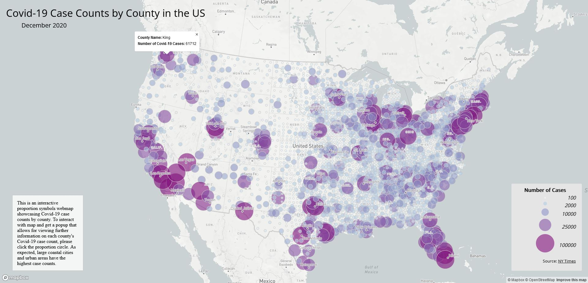

# Covid-19 Counts and Rates Interactive Webmaps

## Introduction
This is a project for GEOG458. The goal of this project was to create two interactive webmaps of the United States, one with proportional symbols and another with choropleth visualizations visualizing data on Covid-19. The Covid-19 data in this project was used from the [NY Times](https://github.com/nytimes/covid-19-data/blob/43d32dde2f87bd4dafbb7d23f5d9e878124018b8/live/us-counties.csv) which has last been updated in December 2020. The population data for the first map is from the [ACS](https://data.census.gov/cedsci/table?g=0100000US%24050000&d=ACS%205-Year%20Estimates%20Data%20Profiles&tid=ACSDP5Y2018.DP05&hidePreview=true). 

## Map Screenshots
The first [webmap](https://swierj.github.io/covid19webmap/map1.html), is a choropleth map highlighting Covid-19 rates across the US by county. The following is a screenshot:

The second [webmap](https://swierj.github.io/covid19webmap/map2.html), is a proportional symbols map highlighting Covid-19 counts across the US by county. The following is a screenshot:

## Functions and Libraries used in Code
The html pages use a mapbox api JS script to display the webmap. Furthermore they import the mapbox style sheet and a google fonts sheet. In the css sheet I use mapbox class that turns the cursor back into a normal pointer when not selecting anything of interest. In the JS files I use a mapbox access token. Furthermore I use the map function to create a new map object where I can select parameters like the style, zoom level, projection, and more. I also import from my assets folder the data using a GeoJson fetch function. The main function for creating the webmaps is the map.on function which loads the json data into the map object that I created previously. This allows me to display and visualize the data by further using functions like addSource (to add the source of the data) and addLayer, which specifies what I want to visualize on the map. For example, the addLayer function is the one where I pass the parameters that determine the type of map (i.e. choropleth or proportion symbols) as well as the color scheme used and the classification of my data. Lastly, the second map.on function specifies the interactivity for the map. For map 1 I used a mouse hover interactivity to display data for each county that the user hovers over and for map 2 I used an on click function which displays further data for the county that the user clicks on. The legend just uses a for each loop(map 1) and a for loop(map 2) and pushes/appends each item into it from the arrays created earlier specifying the data classification and color scheme.

## Credits and Acknowledgement
A portion of the code in this assignment was taken from Professor Zhao's [instructions](https://github.com/jakobzhao/geog458/tree/master/labs/lab03). Furthermore, I also used code from the mapbox tutorial found [here](https://docs.mapbox.com/help/tutorials/choropleth-studio-gl-pt-2/).
